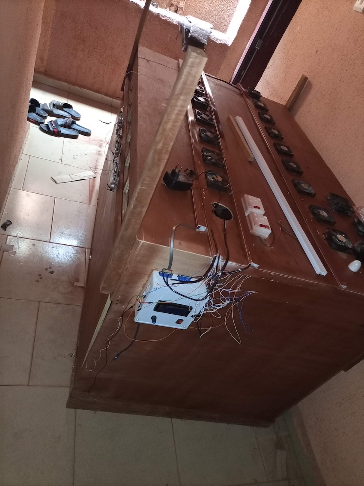
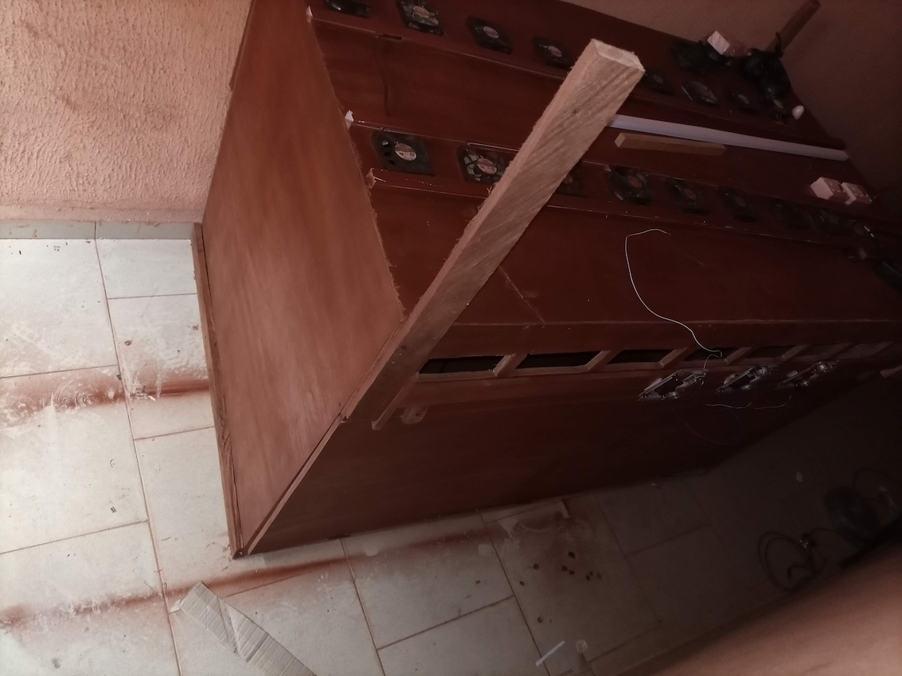

# Automatic Chicken brooder

### A contant temperature and humidity regulator and temperature logging

## Short Information
It is used for brooding of chicks from a day old to two weeks at constant temperature and the system state can be adjusted for poultry farming. The arduino microcontroller maintains a regulated temperature and humidity in the environment and also records real time data from different sections of the brooder. The system monitors which part of the system heats up and which part requires more cooling and collects information on the power supplied for heating and colling as well as information on the temperature and humidity at each instances. 

The data collected on this is logged in a MicroSD Card for collection purposes

## Prototype
|
|

## Repository
- Arduino code `./arduino_code`

## Technologies Used
- Arduino
- DHT11 Humidity sensor
- LM35 temperature sensor
- DS3231 Real Time Clock
- SD Card module
- Electric heaters
- Servo motor controller
