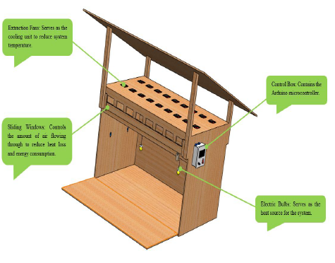

# Automatic Chicken brooder

### A contant temperature and humidity regulator and temperature logging

It is used for brooding of chicks from a day old to two weeks at constant temperature and the system state can be adjusted for poultry farming. The arduino microcontroller unit serves like a switch using a relay module. It controls the run-time of the system elements to ensure constant temperature. It consists of other features like data recording of the temperature readings, measurement and recording of the relative humidity of the system.

## Repository

- Arduino code `./arduino_code`

## Technologies Used

- Arduino
- DHT11 Humidity sensor
- LM35 temperature sensor
